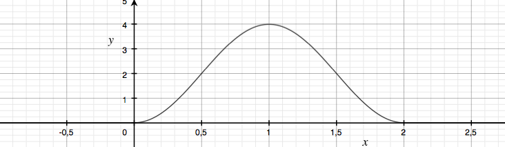

# cos-in-range [](https://travis-ci.org/sreucherand/cos-in-range)

Utility function that maps a value through a cos function given the minimum and maximum value in a defined range.

## Usage

[](https://www.npmjs.com/package/cos-in-range)

```js
import cosInRange from 'cos-in-range';

const value = cosInRange(1, 0, 2, 0, 4); // 4
```



## Tests

```bash
$ npm i
$ npm test
```

## Licence

[MIT](LICENSE)
